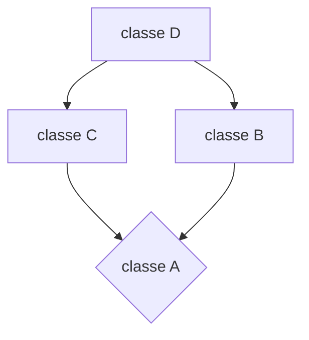

Una classe può essere ereditata da più di una classe base, in questo caso si parla di *Ereditarietà multipla*. 
Con l'ereditarietà multipla ogni oggetto della classe derivata contiene un sottooggetto per ognuna delle classi base da cui deriva.

Illustriamo la situazione con una definizione alternativa della classe `dataora`. Invece di definirla come derivata della classe base `orario` e quindi aggiungendo dei campi dati e metodi che gestiscono la "*data*" i cui oggetti rappresentano una data e quindi definirne la classe `dataora` come derivata sia dalla classe base `orario` che dalla classe base `data`. 

````mermaid
flowchart TD
A[dataora]-->B[orario]
````
````mermaid
flowchart TD
A[dataora]-->B[orario]
A-->C[data]
````
Dichiaramo come segue la classe `data`:
````C++
class data{
public:
	data(int =1, int =1, int =0);
	int Giorno() const { return giorno; }
	int Mese() const { return mese; }
	int Anno() const { return anno; }
protected:
	int giorno, mese, anno;
	void AvanzaUnGiorno;
private:
	int GiorniDelMese() const;
	bool Bisestile() const;
}

/*
La definizione della classe dataora derivata sia dalla classe base orario che dalla classe base data è la seguente
*/

class dataora : public data, public orario{
public:
	dataora() {}
	dataora(int a, int me, int g, int o, int m, int s) : data(a,me,g), orario(o,m,s) {}
	dataora operator+(const orario&) const;
	dataora operator==(const dataora&) const;
	...
};

````
Abbiamo usato la derivazione pubblica sia per la classe base `data` che per la classe base `orario`. In generale la tipologia di derivazione può essere diversa per ogni classe base.
Il costruttore di default `dataora()` definito esplicitamente con corpo vuoto richiama implicitamente i costruttori di defult per i sottooggetti delle classi base nell'ordine in cui esse compaiono testualmente nella definizione della classe `dataora`, cioè prima `data` e poi `orario`.
Questo è anche il comportamento del costruttore di default. Nel nostro casso esso è stato definito perchè altrimenti sarebbe stato nascosto dal costruttore a sei parametri. Il costruttore a 6 parametri richiama esplicitamente i costruttori delle classi base è comunque sempre quello in cui compaiono testualmente le classi base nella definizione della classe derivata. Quindi per `dataora`, prima `data(a,me,g)` e successivamente `orario(o,m,s)`.
Abbiamo visto che l'overriding in una classe D derivata direttamente da B di un metodo di nome `m` definito in `B`, non siano visibili in `D`, e quindi per accedere a tali metodi è necessario ricorrere all'operatore di scoping `B::`.

Cosa succede invece se 2 metodi identificati dallo stesso nome sono definiti in 2 classi base diverse della stessa classe derivata? 
*supponiamo di aver aggiunto `stampa()`sia alla classe `orario` sia alla classe `data` che stampa un'orario e una data*.
```C++
void orario::Stampa() const{
	cout << Ore() << ':' << Minuti() << ':' << Secondi();
}

void data::Stampa() const{
	cout << Giorno() << '/' << Mese() << '/' << Anno();
}
```

Pertanto, la classe `dataora` eredita 2 funzioni diverse con lo stesso nome `Stampa()`. In questa situazioni le istruzioni:
```
dataora d;
d.Stampa(); //Illegale
```
generano un errore in compilazione: a causa dell'*ambiguità* dell'invocazione il compilatore non è in grado di decidere quale dei 2 metodi usare. Si noti che, come al solito per gli errori di compilazione dovuti a situazione di ambiguità,  la generazione dell'errore avviene soltanto quando si cerca di usare tale metodo `Stampa()` su di un oggetto della classe derivata `dataora`e non a causa della definizione della classe derivata `dataora`stessa.
*ATTENZIONE:* L'ambiguità rimane comunque se le segnature dei metodi nelle classi base dovessero essere diverse, come dimostra il seguente esempio:
```C++
class A{
public:
	void f() {cout << "A::f";}
};

class B{
public:
	void f(int x) {cout << "B::f ";}
};

class D: public A, public B{
};

int main(){
	D d;
	d.f(); //Illegale: ambiguità
	d.f(2); //Illegale: ambiguità
}
```
Possiamo risolvere esplicitamente l'ambiguità usando l'operatore di scoping:
```
dataora d;
d.data::Stampa();
//Oppure
dataora d;
d.orario::Stampa();
```
Naturalmente, se avessimo ridefinito il metodo `Stampa()` nella classe `dataora` esso avrebbe nascosto entrambi i metodi `Stampa()` delle classi base e non ci sarebbe quindi stata alcuna ambiguità. Ad esempio, la seguente ridefinizione di `Stampa()` per la classe `dataora` usa l'operatore di scoping per richiamare le funzioni `Stampa()` delle classi base.
```C++
void dataora::Stampa() const{
	data::Stampa();
	cout << ' ';
	orario::Stampa();
}
```

# Derivazione virtuale
Nella programmazione OO una gerarchia di classi può essere **molto** complesso. Può accadere talvolta che una classe derivi da 2 classi basi le quali a loro volta derivano, *direttamente* o *indirettamente*, da una stessa classe. Tale situazione viene anche detta **Ereditarietà a diamante**

In questa situazione succede che ogni oggetto della classe `D` contiene 2 sottooggetti della `classe A`. *Questo comporta i seguenti problemi:*
1. Produce una ambiguità che impedisce di accedere a tali sottooggetti ed ai metodi che operano su di essi
2. Produce uno spreco di memoria
In sostanza:
- `classe A`: `A`
- `classe B`: `A`| membri propri di B
- `classe C`: `A`| membri propri di C
- `classe D` : `A`|membri propri di B , `A`| membri propri di C , membri propri di D

*ESEMPIO:*
```C++
class A{
public:
	int a;
	A(int x=1): a(x) {}
};

class B: public A{
public:
	B(): A(2) {}
};

class C: public A {
public:
	C(): A(3) {}
};

class D: public B, public C { };
```
Il seguente frammento di codice non compila a causa dell'ambiguità generata dalla derivazione multipla.
```C++
D d;
A* p = &d; //Illegale: A è una classe base ambigua per D
cout << p->a; //Quale sottooggetto di A si dovrebbe usare?
```
Si consideri la seguente gerarchia di classi.
```C++
class A {
public:
	virtual void print() =0; //virtuale puro
};

class B: public A{
public:
	virtual void print() {cout << "B ";} //implementazione
};

class C: public A{
public:
	virtual void print() {cout << "C ";} //implementazione
};

class D: public B, public C{
public:
	virtual void print() {cout << "D ";} //ovvìerriding
};
```
In questo caso il seguente frammento di codice non compila ancora a causa dell'ambiguità dovuta all'ereditarietà multipla a diamante.
```C++
D d;
A* p = &d; //Illegale: A è una classe base ambigua per D
p->print(); //la chiamata polimorfa non è legale
```
Una soluzione migliore sarebbe quella di avere un unico sottooggetto di classe A in ogni oggetto della classe D:

Questo si può ottenere usando la *derivazione virtuale*, che nelle figure che rappresentano gerarchie di classi indicheremo con frecce tratteggiate *La derivazione virtuale si ottiene tramite* **keyword** `virtual` che è quindi sovraccaricata da un doppio significato. Le dichiarazioni delle classi `A`, `B`, `C` e `D` diventano le seguenti:
```C++
class A{
...
};
class B : virtual public A{
...
};
class C : virtual public A{
...
};
class D : public B, public C{
...
};
```
Si dice che A è una *classe base virtuale* (per le classi `B` e `C`). Per ogni classe `D`derivata da `A` e definita tramite derivazione multipla il fatto che `A` sia una classe base virtuale garantisce che ci sarà un solo sottooggetto di A in ogni oggetto della classe `D`. Lo standard del linguaggio **NON** prevede come debba essere implementata la derivazione virtuale. Nella pratica essa è implementata tramite dei puntatori in un modello che possiamo astrattamente descrivere nel seguente modo. Gli oggetti delle classi `B` e `C` che derivano virtualmente da `A` oltre al sottooggetto "*ordinario*" della classe `A` contengono un puntatore ad un oggetto della classe `A`. Gli oggetti della classe `D` conterranno invece un puntatore ad un unico sottooggetto di tipo `A`.

**Esempio**:
Consideriamo:
```C++
class A{
public:
	virtual void print()=0;
};
class B: virtual public A{
public:
	virtual void print() {cout << "B ";}
};
class C: virtual public A{
public:
	virtual void print() {cout << "C ";}
};
class D: public B, public C{
public:
	virtual void print() {cout << "D ";}
};
```
In questo caso è necessario definire l’overriding di `print()` in `D` altrimenti si otterrebbe il seguente errore in compilazione: "*no unique final overrider for `A::print()`*".  Con queste nuove definizioni il seguente codice compila e produce la seguente stampa indicata:
```C++
D d;
A* p = &d; //Compila
p->print(); //Stampa: D
```
Anche per la derivazione virtuale multipla, possiamo avere derivazione privata, pubblica o protetta. Quindi in una classe derivata può accadere di avere la stessa classe base virtuale indiretta ma con diverse regole d'accesso. In un caso del genere prevale la modalità di derivazione più permissiva, ovvero vale la seguente regola: la derivazione protetta prevale su quella privata, e la derivazione pubblica prevale su quella protetta. Ad esempio:
```C++
class A { public: void f() {cout << "A";}};

class B: virtual private A {}; //Derivazione virtuale privata

class C: virtual public A {}; //Derivazione virtuale pubblica

class D: public B, public C {}; // prevale la derivazione pubblica

int main() {
	D d;
	d.f(); //OK, stampa: A (è il metodo C::f())
	//d.B::f(); //Illegale A::f() è inaccessibile
}
```

Nei vari costruttori delle classi derivate vi è sempre una chiamata al costruttore della classe base virtuale. Sappiamo che un costruttore di una classe derivata richiama preliminarmente, o con una invocazione esplicita inclusa nella lista di inizializzazione oppure con una invocazione implicita, solamente i costruttori delle superclassi dirette. In presenza di classi base virtuali, il costruttore di una classe derivata richiama in modo preliminare anche i costruttori delle classi virtuali che si trovano nella sua gerarchia di derivazione, *o tramite un invocazione esplicita inclusa nella lista di inizializzazione oppure tramite invocazione implicita*.

La motivazione di ciò sta nel fatto che il sottooggetto di una classe base virtuale `A` è condiviso e quindi non avrebbe senso costruirlo più di una volta. La soluzione consiste pertanto nel costruire una sola volta tale sottooggetto di `A` condiviso e questa costruzione va fatta prima che avvenga la sua condivisione. 

Tenendo in considerazione ereditarietà multipla e classi virtuali, aggiorniamo il comportamento di un costruttore di una classe derivata `D` come segue:
1. Per primi vengono richiamati, una sola volta, i costruttori delle classi virtuali che si trovano nella gerarchia di derivazione di `D`. Vi può essere più di una classe virtuale nella gerarchia di derivazione di `D`: la ricerca delle classi virtuali procede esaminando le superclassi dirette di `D` in ordine di dichiarazione di ereditarietà (*cioè da sinistra verso destra* nella gerarchia), e per ognuna di queste sottogerarchie si cercano, ricorsivamente, le classi base virtuali. Quindi si ricercano le classi virtuali nella gerarchia seguendo l'ordine da sinistra verso destra e dall'alto verso il basso ("*left-to-right top-down order*").
2. Una volta che sono stati invocati i costruttori delle classi virtuali nella gerarchia di derivazione di `D`, vengono richiamati i costruttori delle superclassi dirette non virtuali di `D`: questi costruttori escludono di richiamare eventuali costruttori di classi virtuali già richiamati al passo (1)
3. Infine viene eseguito il costruttore "proprio" di `D`, ovvero vengono costruiti i campi dati propri di D e quindi viene eseguito il corpo del costruttore di `D`.
Le chiamate dei costruttori dei punti (1) e (2) se non sono esplicitamente definite, vengono automaticamente inserite dal compilatore nella lista di inizializzazione del costruttore di `D`: in questo caso, come al solito si tratta di chiamate implicite ai costruttori di default.
*esempio:*
```C++
class A {...};
class B : virtual public A {...};
class C : virtual public A {...};
class D : public B, public C {...};
```

Il compito di costruire il sottooggetto della classe base virtuale `A` viene lasciato alla classe dell'oggetto principale che stiamo definendo, nel nostro caso al costruttore della classe `D`. Pertanto, una eventuale chiamata esplicita al costruttore della classe virtuale `A` deve essere messa nella lista di inizializzazione della classe `D`. Di conseguenza, se nelle liste di inizializzazione delle classi `B` e `C` compare una invocazione al costruttore di `A`, nella costruzione di un oggetto di `D` tale chiamata viene ignorata. Vediamo alcuni esempi che illustrano l'ordine delle chiamate dei costruttori in una gerarchia di derivazione con classi base virtuali. In questi esempi le chiamate dei costruttori delle classi virtuali sono sempre implicite
*Esempio 1*
```C++
class A{
public:
	int a;
	A(int x=1): a(x) {}
};
class B: virtual public A{
public:
	B(): A(2) {}
};
class C: virtual public A{
public:
	C(): A(3) {}
};

class D: public B, public C { };

/*
Il seguente codice compila e produce:
*/
D d;
A* p = &d; //compila
cout << p->a; //Stampa: 1 (e non 2 o 3!)
```
*Esempio 2*
```C++
class A {
public: A() {cout << "A ";}
};
class B {
public: B() {cout << "B ";}
};
class C: virtual public A {
public: C() {cout << "C ";}
};
class D: public B{
public: D() {cout << "D ";}
};
class E: public C, virtual public D{
public: E() {cout << "E ";}
};
int main() { E e; } //stampa: A B D C E
```

