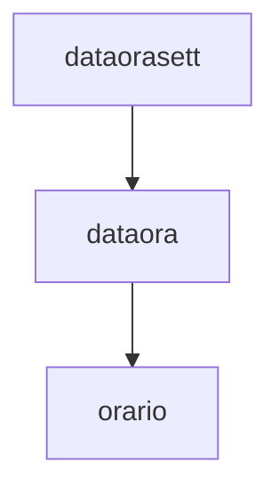

È  uno dei concetti fondamentali della programmazione ad oggetti. Lo strumento centrale per l'ereditarietà è la **derivazione tra classi**. 
## Sottoclassi
Abbiamo modellato il concetto di orario tramite la classe orario. Supponiamo ora di voler modellare il concetto di "orario con data" che quindi raffina il concetto di orario. Possiamo usare la classe `orario`per definire una nuova classe `dataora`che eredita da essa tutte le proprietà di `orario` ed a cui attribuiamo le ulteriori proprietà che ci interessano per modellare il concetto di orario con data.
````C++
//dichiarazione classe orario
class orario{
	friend  ostream& operator<<(ostream&, const orario&);
public:
	orario(int o=0, int m=0, int s=0);
	int Ore() const;
	int Minuti() const;
	int Secondi() const;
	orario operator+(const orario&) const;
	bool operator==(const orario&) const;
	bool operator<(const orario&) const;
private:
	int sec;
};
````
[[ADT]] **dataora**, una data con orario: **31/12/99 ore 23:59** In particolare, un valore data ora **è un**  orario.
````C++
class dataora : public orario{
private:
	int giorno;
	int mese;
	int anno;
public:
	int Giorno() const;
	int Mese() const;
	int Anno() const;
};
````
**Terminologia**!!!!!!!!!
Classe base **`B`** e classe derivata **`D`**
Sottoclasse **`D`** e superclasse **`B`**
Sottotipo **`D`** e supertipo **`B`**
![[Pasted image 20231122154112.png]]

**NOTA IMPORTANTE SE NON FONDAMENTALE:** *Ogni oggetto della classe derivata è utilizzabile come oggetto della classe base* ovvero che se **`D`** deriva da **`B`** allora vi è una conversione implicita da **`D`** a **`B`** che estrae da ogni oggetto `x` di `D`il sotto-oggetto di `x`della classe `B`.
# Subtyping (subsumption)
Relazione "is-a" induce il **subtyping** che è la **caratteristica fondamentale dell'ereditarietà**

Il **sottotipo** è una forma di *polimorfismo di tipo* in cui un **sottotipo** è un tipo di dato che è correlato a un altro tipo di dato (*o supertipo*) da una qualche nozione di *sostituibilità*, il che significa che gli elementi del programma, tipicamente *subroutine* o funzioni, scritti per operare su elementi del supertipo possono operare anche su elementi del sottotipo. 
-> *Ogni oggetto della classe derivata è utilizzabile anche come oggetto della classe base*
- **Subtyping:** sottotipo **`D`** => Supertipo **`B`**
- Per oggetti: **`D`** => **`B`** *estrae il sottooggetto*
-> **Subtyping per _puntatori_ e _riferimenti_**
**`D*`** =>**`B*`**          **`D&`** => **`B&`**
Puntatori e riferimenti *polimorfi*

**Gerarchie di classi:** sottotipi *diretti* ed *indiretti*
Base<-D<-E<-F

## Casi d'uso di ereditarietà
1. **Estensione** `dataora <: orario`
2. **Specializzazione** `QButton <: QComponent`
3. **Ridefinizione** `Queue <: List`
4. **Riutilizzo di codice** (*Non è subtyping*) `Queue reuse List`

Se vogliamo definire un tipo che oltre alle proprietà di `dataora` memorizzi anche il giorno della settimana possiamo farlo con la seguente derivazione di classe:
````C++
//tipo enumerazione giorno
enum giorno {lun, mar, mer, gio, ven, sab, dom};

class dataorasett : public dataora{
public:
	giorno GiornoSettimana() const;
private:
	giorno giornosettimana;
};
````
_Tipo user-defined **enum**_
![[Pasted image 20231122171212.png]]
Data una classe **`B`**, per ogni sottotipo **`D`** (in generale indiretto) di **`B`** valgono quindi le seguenti *conversioni implicite*:
- **`D`** => **`B`** (*oggetti*)
- **`D&`** => **`B&`** (*riferimenti*)
- **`D*`** => **`B*`** (*puntatori*)

Grazie alla conversione implicita `dataora` => `orario`
possiamo scrivere: 
````C++
int F(orario o) {...}
dataora d;
int i = F(d);
````
**Il viceversa non vale!**
````C++
int G(dataora d) {...}
orario o;
int i = G(o); //ILLEGALE
````
Un `dataora` è (*in particolare*) un `orario`, mentre un `orario` non è un `dataora`!

### Polimorfismo in C++ mediante puntatori e riferimenti e non oggetti
Sia `D` una sottoclasse di `B`
````C++
D d; B b;
D* pd=&d;
B* pb=&b;
pb = pd;
````
*tipo statico* del puntatore `pb` versus *tipo dinamico* di `pb`
**Quindi:** il *tipo statico* di un puntatore `p` è il tipo `T*` di dichiarazione di `p`, mentre se in un certo istante dell'esecuzione il tipo dell'oggetto a cui effettivamente punta `p` è `U` allora quell'istante `U*` è il *tipo dinamico* di `p`.
*Mentre il tipo statico è fissato al momento della dichiarazione, il tipo dinamico in generale può variare a run-time*.

Concetti e terminologia analoghi valgono per i riferimenti:
````C++
D d; B b;
D& rd=d;
B& rb=d;

//D& è il tipo dinamico di rb
````
#### Gerarchie di classi 
Abbiamo già osservato che una classe derivata può a sua volta essere usata come classe base per un ulteriore derivazione. Ad esempio definiamo un tipo che oltre alle proprietà di `dataora`memorizzi anche il giorno della settimana
```C++
//tipo enumerazione settimana
enum settimana{lun,mar,mer,gio,ven,sab,dom}

class dataorasett : public dataora{
public:
	settimana GiornoSettimana() const;
private:
	settimana giornosettimana;
};
```
*Diagramma della gerarchia:*

## Accessibilità
Una classe derivata può accedere alla parte privata di una sua classe base? **NO**
*La parte privata di una qualsiasi classe `B` è inaccessibile alle classi derivate da `B` come lo è per ogni altra classe diversa da `B`.*
##### La parte privata della classe base è inaccessibile alla classe derivata
Aggiungendo alla classe `dataora` un metodo `Set2K()` che assegna all'oggetto di invocazione le ore 00:00:00 del 1 gennaio 2000 **non possiamo scrivere**
````C++
dataora::Set2K(){
	sec = 0; //NO ILLEGALE
	giorno = 1;
	mese = 1;
	anno = 2000;
}
````
Perchè il campo dati `sec`è nella parte privata della classe base `orario`. D'altra parte una classe derivata da una classe base `B`ha certamente una relazione privilegiata rispetto ad una qualsiasi altra classe esterna a `B`. Infatti, oltre alle parti private e pubbliche di una classe `B` è prevista anche una parte `protected`, *i cui membri risultano accessibili alle classi derivate da `B`ma non risultano accessibili alle classi esterne a `B`*

Membro | public | protected | private
-----|--------|---------|----
private | inaccessibile | inaccessibile | inaccessibile
protected | protetto | protetto | privato 
public | pubblico | protetto | privato

![[Pasted image 20231122173344.png]]
**ATTENZIONE!!!!!!!**:
- I membri `protected` rappresentano comunque una **violazione** dell'[[Information hiding]] -> modifiche a questo può comportare modifiche alle sottoclassi
````C++
class C{
private:
	int priv;
protected:
	int prot;
public:
	int publ;
};

class D: private C{
	//prot e publ divengono privati
};

class E: protected C{
	//prot e publ divengono protetti
};

class F: public D{
	//prot e publ sono qui inaccessibili
public:
	void fF(int i, int j){
		//prot=i; //ILLEGALE
		//publ=j; //ILLEGALE
	}
};

class G: public E{
	//prot e publ rimangono qui protetti
	void fG(int i, int j){
		prot=i; //OK
		publ=j; //OK
	}
};
````

LA forma di derivazione più diffusa è senz'altro quella pubblica, detta anche *ereditarietà di tipo*. In questo caso i metodi pubblici della classe base rimangono pubblici nella classe derivata. Quindi l'interfaccia pubblica di una classe D derivata direttamente da una classe base B si ottiene dall'interfaccia pubblica originaria di B aggiungendo i nuovi membri dichiarati pubblici nella classe derivata D.

### Ereditarietà privata o ereditarietà di implementazione
significa "essere implementati in termini di". Se `D` deriva praticamente da `B` significa che in `D` si è interessati ad alcune funzionalità di `B` e non si è interessati ad una *relazione concettuale di subtyping* tra `D`e`B`. L'ereditarietà privata eredita l'implementazione di `B` ma non l'interfaccia di B. *L'ereditarietà privata non gioca alcun ruolo nella fase di progettazione del software ma solo nella fase di implementazione del software.*

##### Ereditarietà privata vs relazione has-a
````C++
class Motore{
private:
	int numCilindri;
public:
	Motore(int nc): numCilindri(nc) {}
	int getCilindri() const {return numCilindri;}
	void accendi() const{
	cout << "Motore a " << getCilindri() << " cilindri accesso" << endl;}
};
````
###### Relazione has-a
````C++
class Motore{
private:
	int numCilindri;
public:
	Motore(iint nc): numCilindri(nc) {}
	int getCilindri() const {return numCilindri;}
	void accendi() const;{
	cout << "Motore a " << getCilindti() << " cilindri accesso" << endl;}
}

Class Auto{
private:
	Motore mot; //Auto has-a Motore come campo dati
public:
	Auto(int nc = 4): mot(4) {}
	void accendi() const {
		mot.accendi();
		cout << "Auto con motore a " << mot.getCilindri() << " cilindri accesa" << endl;
	}
};
````
###### Ereditarietà privata
````C++
class Motore{
private:
	int numCilindri;
public:
	Motore(int nc): numCilindri(nc) {}
	int getCilindri () const {return numCilindri;}
	void accendi() const{
	cout << "Motore a " << getCilindri() << " cilindri accesso" << endl;}
};

Class Auto: private Motore{ //Auto has-a Motore come sottooggetto
public:
	Auto(int nc = 4): Motore(nc) {}
	void accendi() const{
		Motore::accendi();
		cout << "Auto con motore a " << getCilindri() << " cilindri accessa" << endl;
	}
};
````
**_Similarità_**
1. In entrambi i casi un oggetto Motore "contenuto" in ogni oggetto Auto.
2. In entrambi i casi, per gli utenti esterni, Auto* non è convertibile a Motore*
_**Differenze**_
1) La composizione è necessaria se servono **più motori** in un auto (*a meno di usi limite di ereditarietà multipla*)
2) Ered.privata può introdurre **ereditarietà multipla** (*problematica*) **non necessaria**
3) Ered.privata **permette ad Auto** di convertire `Auto*` a `Motore*`
4) Ered.privata permette **l'accesso alla parte protetta** della base

#### Conversioni implicite e tipologia di derivazione
Le conversioni implicite indotte dalla derivazione **valgono solamente per la derivazione pubblica** che è quindi l'unica tipologia di derivazione che supporta la relazione "is-a". La derivazione protetta e la derivazione privata **non inducono** alcuna conversione implicita.
````C++
class C{
private:
	int i;
protected:
	char c;
public:
	float f;
};

class D: private C { }; //derivazione privata
class E: protected C { }; //derivazione pubblica
// nessuna conversione implicita D => C e E => C
int main(){
	C c, *pc; D d, *pd; E e, *pe;
//c=d; //ILLEGALE: "C is an inaccessible base of D"
//c=e; //ILLEGALE
//pc=&d; //ILLEGALE
//pc=&e; //ILLEGALE
//C& rc=d; //ILLEGALE
}
````
**Ereditare i metodi pubblici**
````C++
class Base{
	int x;
public:
	void f() {x=2;}
};

class Derivata: public Base{
	int y;
public:
	void g() {y=3;}
};

int main(){
	Base b; Derivata d;
	Base* p = &b; Derivata* q = &d;
	p->f(); //OK
	p=&d; //Derivata* è ora il tipo dinamico di p
	p->f(); //OK
	p->g(); //HA senso?
	q->g(); //OK
	q->f();//OK
}
````
**Conversioni Base*=>Derivata*, Base& => Derivata&**
````C++
//VI significa valore (intero) Imprevedibile
class C{
public:
	int x;
	void f() {x=4;}
};

class D: public C{
public:
	int y;
	void g() {x=5; y=6;}
};

class E: public D{
public:
	int x;
	void h() {x=7; y=8; z=9;}
};

int main(){
	C c; D d; E e;
	c.f(); D.g(); e.h();
	D* pd = static_cast<D*> (&c); //PERICOLOSO!!
	cout << pd->x << " " << pd->y << endl; //errore run-time o stampa: 4 VI
	E& re = static_cast<E&> (d); //PERICOLOSO!!
	cout << re.x << " " << re.y << " " << re.z << endl; //err. run-time o stampa: 5 6 VI
	C* pc = &d; pd = static_cast<D*> (pc); //OK
	cout << pd->x << " " << pd -> << endl; //stampa 5 6
	D& rd = e; E& rel = static_cast<E&> (rd); //OK
	cout << rel.x << " " << rel.y << " " << rel.z << endl; //stampa 7 8 9
}
````

# Ereditarietà e amicizia: le amicizie non si ereditano
Falsa [[Amicizia]]
````C++
class C{
private:
	int i;
public:
	C(): i(1) {}
	friend void print(C);
};

class D: public C{
private:
	double z;
public:
	D(): z(3.14) {}
};

void print(C x){
	cout << x.i << endl;
	D d;
//cout << d.z << endl; //illegale
//"D::z is private within this context"
}

int main(){
	C c; D d;
	print(c); //stampa 1
	print(d); // Ok, stampa 1
}
````
````C++
class C{
	friend class Z;
private:
	int i;
public:
	C(): i(1) {}
};

class D: public C {
private:
	double z;
public:
	D(): z(3.14) {}
};

class Z {
public:
	void m() {C c; D d; cout << c.i; //OK
	cout << d.z; //ILLEGALE: "D::z is private within this context"
	}
};

int main(){
	Z z;
	z.m(); //stampa: 1
}
````
````C++
class C{
private:
	int i;
public:
	C(): i(1) {}
	friend void print(C);
};
void print(C x) {cout << x.i << endl;}

class D: public C{
private:
	double z;
public:
	D(): z(3.14) {}
	friend void print(D);
};
void print(D x) {cout << x.z << endl;}

int main() {
	C c; D d;
	print(c); //stampa 1
	print(d); //stampa 3.14
}
````
#### Sul significato di inaccessibile
````C++
class C{
private:
	int i;
public:
	C(): i(1) {}
	void print() {cout << ' ' << i;}
};

class D: public C {
private:
	double z;
public:
	D(): z(3.14) {}
	void print() {
		C::print(); //l'oggetto di invocazione di C::print() è il sottooggetto di tipo C dell'oggetto di invocazioen
		//cout << ' ' << this->i; //membro i INACCESSIBILE
		cout << ' ' << z;
	}
};

int main() {
	C c; D d;
	c.print(); cout << endl; //stampa 1
	d.print(); cout << endl; //stampa 1 3.14
}
````

# Sul significato di protected
````C++
class B{
protected:
	int i;
	void protected_printB() const {cout << ' ' << i;}
public:
	void printB() const {cout << ' ' << i;}
};

class D: public B{
private:
	double z;
public:
	void stampa() {
		cout << i << ' ' << z; //OK
	}

	static void stampa(const B& b, const D& d){
		cout << ' ' << b.i; //Illegale: "B::i is protected within this context"
		b.printB(); //OK
		b.protected_printB(); //ILLEGALE: "B::protected_printB() is protected within this context"
		cout << ' ' << d.i; //OK
		d.printB(); //OK
		d.protected_printB(); //OK
	}
};
````
### Ridefinizione di metodi
In una classe `D`derivata da `B`tipicamente si aggiungono dei membri propri (campi dati, metodi, classi annidate) ai membri ereditati dalla classe base `B`. D'altra parte, in `D`è anche possibile *ridefinire* i campi dati e i metodi ereditati da `B`.  Ciò significa che nella classe `D`si ridefinisce il significato di un membro `b`ereditato da `B` tramite una nuova definizione che nasconde quella ereditata da `B`. In `D`è possibile usare l'operatore di scoping `B::b` per accedere al membro `b` definito in `b`. 

Potrebbe avere senso ridefinire nella classe derivata alcune funzionalità ereditate dalla classe base.
I metodi sono concepiti come dai contratti, quindi l'implementazione di un contratto della classe base potrebbe richiedere **variazioni o adattamenti** nella classe derivata

**Ridefinizione di orario::operator+**
````C++
dataora dataora::operator+(const orario& o) const{
	dataora aux = *this;
	//Attenzione:
	//aux.sec = sec + o.sec; //darebbe un errore di compilazione!
	//perchè anche se sec è dichiarato protected in orario, o.sec è comunque inaccessibile in dataora
	aux.sec = sec + 3600*o.Ore() + 60*o.Minuti() + o.Secondi();
	if (aux.sec >= 86400){
		aux.sec = aux.sec - 86400;
		aux.AvanzaUnGiorno();
	}
	return aux;
}

void dataora::AvanzaUnGiorno(){//metodo proprio
	if (giorno < GiorniDelMese()) giorno++;
	else if (mese < 12) {giorno = 1; mese++;}
	else {giorno = 1; mese = 1; anno++;}
}
````
Possiamo invocare l'operatore + di `orario` o `dataora` nel modo seguente:
````C++
orario o1, o2;
dataora d1, d2;
o1 + o2; //invoca orario::operator+
d1 + d2; //incvoca dataora::operator+
o1 + d2; //invoca orario::operator+
d1 + o2; //invoca dataora::operator+
orario y = d1 + d2; //OK
dataora x = o1 + o2; //ILLEGALE
d1.orario::operator+(d2); //invoca orario::operator+
````
**ESEMPIO**
```C++
class B {
protected:
	int x;
public:
	B() : x(2) {}
	void print() { cout << x << endl; }
};

class D: public B {
private:
	double x; //ridefinizione del campo dati x
public: 
	D() : x(3.14) {}
	// ridefinizione di print()
	void print() { cout << x << endl; } // è la x di D
	void printAll() { cout << B::x << ' ' << x << endl; }
};

int main() {
	B b; D d;
	b.print(); //stampa 2
	d.print(); //stampa 3.14
	d.printAll(); //stampa 2 3.14
}
```
### Name hiding rule
Una ridefinizione in `D` del nome di metodo `m()` nasconde sempre tutte le versioni sovraccaricate di `m()` disponibili in `B`, che non sono quindi direttamente accessibili in `D` ma solamente tramite l'operatore di scoping `B::`

Se ridefiniamo il metodo `Ore` in `dataora` con segnatura:
````C++
int dataora::Ore(int) const{
	...
}
````
non possiamo più scrivere:
````C++
dataora d;
cout << d.Ore(); //ILLEGALE
````
Perchè il "vecchio" metodo `Ore` della classe `orario` è **mascherato** in `dataora` dalla ridefinizione. Per l'accesso possiamo però usare l'operatore di scoping:
````C++
dataora d;
cout << d.orario::Ore();
````

#### Ridefinizione di campi dati
````C++
class B{
protected:
	int x;
public:
	B() : x(2) {}
	void print() {cout << x << endl;}
};

class D: public B {
private:
	double x; //ridefinizione del campo dati x
public:
	D() : x(3.14) {}
	//ridefinizione di print()
	void print() {cout << x << endl;} // è D::x
	void printAll() {cout << B::x << ' ' << x << endl;}
};

main(){
	B b; D d;
	b.print(); //stampa: 2
	d.print(); //stampa: 3.14
	d.printAll(); //stampa 2 3.14
}
````

#### Static binding nell'invocazione di metodi
![[Pasted image 20231125155742.png]]
````C++
class Base {
	int x;
public:
	void f() {x=2;}
};
class Derivata:  public Base {
	int y;
public:
	void f() {Base::f(); y=3;} //ridefinizione
};

int main() {
	Base b; Derivata d;
	Base* p = &b;
	p->f(); //invoca Base::f()
	p=&d; //Derivata* è il tipo dinamico di p
	p->f(); //cosa invoca?
} //Base::f()
````
````C++
class B{
public:
	int f() const {cout << "B::f()\n"; return 1;}
	int f(string) const {cout << "B::f(string)\n"; return 2;}
};

class D : public B{
public:
	//ridefinizione con la stessa segnatura
	int f() const {cout << "D::f()\n"; return 3;}
};

class E : public B {
public:
	//ridefinizione con cambio del tipo di ritorno
	void f() const {cout << "E::f()\n";}
};

class H : public B {
public:
	//ridefinizione con cambio lista argomenti
	int f(int) const {cout << "H::f()\n"; return 4;}
};

int main(){
	string s; B b; D d; E e; H h;
	int x = d.f(); //stampa: D::f()
	//d.f(s); //ILLEGALE
	//x = e.f(); //ILLEGALE
	//x = h.f(); //ILLEGALE
	x = h.f(1); //stampa: H::f()
}
````
````C++
class C{
public:
	void f(int x){ }
	void f() { }
};
class D: public C {
	int y;
public:
	void f(int x) {f(); y=3+x;}
	//Illegale
	//"no matching function for D::f()"
};
````
````C++
class C{
public:
	void f() {cout << "C::f\n";}
};

class D: public C{
public:
	void f() {cout << "D::f\n";}; //ridefinizione
};

class E: public D{
public:
	void f() {cout << "E::f\n";}; //ridefinizione
};

int main(){
	C c; D d; E e;
	C* pc = &c; E* pe = &e;
	c = d; //OK conversione D => C
	c = e; //OK E => C
	d = e; //OK E => D
	C& rc = d, //OK D => C
	D& rd = e; //OK E => D
	pc->f(); //OK
	pc = pe; //OK E* => C*
	rd.f(); //OK
	c.f(); //OK
	pc->f(); //OK
}
````

# Costruttori, distruttori, assegnazioni nelle classi derivate
*Naturalmente, i costruttori, l'assegnazione ed il distruttore della classe base non sono ereditati dalla classe derivata, ma naturalmente c'è la possibilità per costruttori, assegnazione e distruttore della classe derivata di invocare quelli della classe base*.

Ricordiamo che ogni oggetto di una classe `D`derivata direttamente da una classe base `B`, per effetto dei campi dati ereditati in `D`da `B`, contiene un sottooggetto della classe base `B`. Dunque, quando si istanzia un oggetto `d`di `D`occorrerà richiamare, esplicitamente o implicitamente nel costruttore di `D`, un costruttore di `B`per inizializzare il *sottoggetto* di `d`della classe base `B`.

*Invocazione esplicita:* è possibile inserire esplicitamente nella lista di inizializzazione del costruttore di `D`un'invocazione esplicita di un qualsiasi costruttore di `B`

*Invocazione implicita:* se la lista di inizializzazione del costruttore di `D`non include invocazioni esplicite di qualche costruttore di `B`allora viene implicitamente ed automaticamente invocato il costruttore di default di `B`, che dovrà quindi essere disponibile.

![[Pasted image 20231125164121.png]]
[[Costruttori#Costruttori nelle classe derivate]]
[[Distruttori#Distruttore standard nelle classi derivate]]


# Esempio di derivazione
Esempio classe poligono
````mermaid
flowchart TD
	A[Poligono] --> B[Quadrilatero]
	A[Poligono] --> C[Triangolo]
	B[Quadrilatero] --> D[Deltoide]
	B[Quadrilatero] --> E[Trapezio]
	B[Quadrilatero] --> F[parallelogramma]
	F[parallelogramma] --> G[rettangolo]
	F[parallelogramma] --> H[rombo]
	G[rettangolo] --> I[quadrato]
	H[rombo] --> I[quadrato] 
	C[Triangolo] --> L[scaleno]
	C[Triangolo] --> M[isoscele]
	M[isoscele] --> N[equilatero]
````

````C++
//file pol.h
#ifndef POL_H
#define POL_H

class punto {
private:
	double x, y;
public:
	punto(double a=0, double b=0): x(a), y(b) {}
	//metodo statico che calcola la distanza tra 2 punti
	static double lung(const punto& p1, const punto& p2);
};

class poligono{
protected:
	unsigned int nvertici;
	punto* pp; //array dinamico di punti, nessun controllo di consistenza
public:
	//si assume v array ordinato degli n vertici
	poligono(unsigned int n, const punto v[]);
	~poligono(); //distruttore profondo
	poligono(const poligono&); //copia profonda
	poligono& operator=(const poligono&); //assegnazione profonda
	double perimetro() const; //ritorna il perimetro del poligono
};
#endif

//file pol.cpp
//HomeWork
````
````C++
//file ret.h
#ifndef RET_H
#define RET_H
#include "pol.h"
class rettangolo: public poligono{ //rettangolo è un poligono specializzato
public:
	rettangolo(const punto v[]); //nvertici == 4
	double perimetro() const; //ridefinizione
	double area() const; //metodo proprio di rettangolo
};
#endif
//file ret.cpp
#include "ret.h"

//NB: nessun controllo che i punti di v formino un rettangolo
rettangolo::rettangolo(const punto v[]) : poligono(4, v) {}

//specializzazione della funzionalità di calcolo del perimetro
double rettangolo::perimetro() const{
	double base = punto::lung(pp[1], pp[0]);
	double altezza = puntoç::lung(pp[2], pp[1]);
	return ((base + altezza)*2);
}

double rettangolo::area() const{
	double base = punto::lung(pp[1], pp[0]);
	double altezza = punto::lung(pp[2], pp[1]);
	return (base*altezza);
}
````
````C++
//file ret.h
#ifndef RET_H
#define RET_H
#include "pol.h"
class rettangolo: public poligono{ //rettangolo è un poligono specializzato
public:
	rettangolo(const punto v[]); //nvertici == 4
	double perimetro() const; //ridefinizione
	double area() const; //metodo proprio di rettangolo
};
#endif
````
````C++
#ifndef QUA_H
#define QUA_H
#include "ret.h"
//quadrato è un rettangolo specializzato
class quadrato: public rettangolo{
public:
	quadrato(const punto v[]); //invoca quello di rettangolo
	double perimetro() const; //ridefinizione
	double area() const; //ridefinizione
};
#endif

//File qua.cpp
#include "qua.h"
//nessun controllo che i punti di v formino un quadrato
quadrato::quadrato(const punto v[]) : rettangolo(v) {}

// specializzazione della funzionalità di calcolo del perimetro
double quadrato::perimetro() const{
	double lato = punto::lung(pp[1], pp[0]);
	return (lato *4):
}

//specializzazione della funzionalità di calcolo dell'area
double quadrato::area() const{
	double lato = punto::lung(pp[1], pp[0]);
	return (lato*lato);
}
````
````C++
//file tri.h
#ifndef TRI_H
#define TRI_H
#include "pol.h"

class triangolo: public poligono{
public:
	triangolo(const punto v[]); //3 vertici
	double area() const; //metodo proprio di triangolo
						//perimetro() ereditato
};
//file tri.cpp
#include "tri.h"
#include <math.h>

triangolo::triangolo(const punto v[]): poligono(3, v) {}

double triangolo::area() const { //usa la formula di Erone
	double p = perimetro()/2;
	double a=punto::lung(pp[1], pp[0]), b=punto::lung(pp[2], pp[1]),
			c=punto::lung(p[0], pp[2]);
	return sqrt(p*(p-a)*(p-b)*(p-c));
}
````
````C++
#include <iostream>
#include "pol.h"
#include "tri.h"
#include "ret.h"
#include "qua.h"
using namespace std;

int main() {
	int i; punto v[4]; double x,y;
	cout << "Scrivi le coordinate di un triangolo" << endl;
	for(i=0; i<3; i++){cin >> x >> y; v[i]=punto(x,y);}
	const triangolo tri(v);
	cout << "Scrivi le coordinate di un rettangolo" << endl;
	for(i=0; i<4; i++){cin >> x >> y; v[i]=punto(x,y);}
	rettangolo ret1(v), ret2 = ret1;
	cout << "Scrivi le coordinate di un quadrato" << endl;
	for(i=0; i<4; i++) {cin >> x >> y; v[i]=punto(x,y);}
	quadrato qua1(v), qua2;
	qua2 = qua1;
	cout << "Triangolo:\n" << tri.perimetro()
		<< '\t' << tri.area() << endl;
	cout << "Rettangolo:\n" << ret2.perimetro()
		<< '\t' << ret2.area() << endl;
	cout << "Quadrato:\n" << qua2.perimetro()
		<< '\t' << qua2.area() << endl;
}
````

[[Template#Ereditarietà e template]]
# Metodi virtuali
Un oggetto di una classe derivata può essere usato ovunque sia richiesto un oggetto della classe base, ossia esiste una conversione implicita da oggetti di una classe derivata a oggetti di una classe base che estrae i corrispondenti sottooggetti. Ad esempio la funzione:
`void F(orario o)`
con un parametro formale di tipo `orario` può essere richiamandone passandole un parametro attuale di tipo `dataora`:
`dataora d; F(d);`
Cosa succede? Poichè il parametro `o` è passato per valore viene invocato il costruttore di copia di `orario` che costruisce `o` copiando il sottooggetto di tipo `orario` del parametro attuale `d`. Consideriamo invece la seguente funzione `G`.
```
void G(const orario& o); 
...
dataora d;
G(d);
```
Se il parametro formale di tipo `orario` è un riferimento (_costante_) possiamo richiamare la funzione con un parametro attuale di tipo `dataora`: in questo caso non viene fatta una copia del sottooggetto di `d` ma il parametro formale `o` diventa invece un alias dell'oggetto `d` di tipo `dataora`. Nella funzione `G` abbiamo che TS(o) = `const orario&` e quindi nel corpo di G il parametro `o` ha tipo dinamico `const dataora&` , cioè il fatto che a run-time succede che `o`in effetti è un riferimento ad un oggetto di `dataora`. Supponiamo ad esempio che in G il parametro `o`venga usato come oggetto di invocazione di un metodo `Stampa()`della classe `orario`che è stato ridefinito nella classe `dataora`:
`void G(const orario& o) {o.Stampa();}`
In questo caso se invochiamo G con parametro attuale `d` di tipo `dataora`verrà invocato il metodo `orario::Stampa()` o il metodo ridefinito `dataora::Stampa()`? Nel caso considerato il legame tra l'oggettto di invocazione `o` e la funzione `Stampa()` è *statico*, cioè viene effettuato a tempo di compilazione. Viene quindi invocato `orario::Stampa()`. Possiamo però fare in modo che, quando il parametro è passato per riferimento, l'associazione tra oggetto di invocazione e metodo da invocare venga effettuata a tempo di esecuzione in base al tipo dinamico del parametro e non in base al suo tipo statico. Un discorso analogo vale per un parametro di tipo puntatore, ad esempio `orario*`
`void G(orario* p) {p->Stampa();}`

Lo strumento C++ per far ciò è _la dichiarazione di un **metodo virtuale**._ Dichiarando virtuale, tramite la *keyword* `virtual`, il metodo `Stampa()` della classe base `orario` nel modo seguente:
```C++
class orario{
	virtual void Stampa();
	...
};

void G(const orario& o) {o.Stampa();}
```
nella funzione `G` verrà invocato `dataora::Stampa()` se TD(o)=`const dataora&` mentre verrà invocato `orario::Stampa()` se TD(o)=`const orario&`.
*In altre parole se in una invocazione `G(x);` il parametro attuale `x` è di tipo `dataora` viene invocato il metodo `dataora::Stampa()` mentre se `x` è di tipo `orario` vine invocato `orario::Stampa()`. Si tratta del cosidetto* **legame dinamico _(dynamic binding o late binding_** *tra oggetto di invocazione e metodo virtuale.* 

Il metodo virtuale da invocare verrà selezionato solamente a *run-time* e non staticamente dal compilatore (*tale meccanismo di invocazione vine anche detto dynamic lookup*). 

**_Virtual_:** *permette di invocare metodi in base al loro tipo dinamico, "bypassando" il legame statico che c'è tra un oggetto e i suoi metodi* -> _deciso a compile time_

**Differenza tra Overriding e Overloading:**
- **Overriding**:
	- *cambio il comportamento di un singolo metodo*
	- *in Java tutti i metodi sono di default virtuali*
- **Overloading**:
	- *ho più metodi e modifico il comportamento degli operatori*
###### Esempio:
```C++
dataora d;
orario* p = &d;
p->Stampa(); //oppure: (*p).Stampa()
```
In questo caso, se `orario::Stampa()` è stato dichiarato virtuale allora viene invocato `dataora::Stampa()`, altrimenti se `orario::stampa()` non è virtuale viene invocato (*staticamente determinato*) `orario::Stampa()`.
Quindi marcando virtuale un metodo `m()` di una classe il progettista delega alle ridefinizioni di `m()` nelle sottoclassi di `B` il compito di implementare quel metodo virtuale `m()`in modo specifico alla particolare sottoclasse. **Una ridefinizione di un metodo virtuale `m()`viene anche detta _overriding_ di `m()`.**
Quando in una classe `B` si dichiara virtuale un metodo `m()` esso resta virtuale in tutta la gerarchia di classi che derivano dalla classe `B`, anche se `m()` non è dichiarato esplicitamente virtuale nella ridefinizione operata dalle sottoclassi di `B`. A volte si segue la prassi di dichiarare esplicitamente che un metodo è virtuale in ogni sottoclasse dove viene ridefinito.
*Se una sottoclasse `D` di `B` non ridefinisce il metodo virtuale `m()`allora `D`semplicemente eredita la definizione di `m()` presente nella sua superclasse diretta* (**Attenzione non la riprende dalla superclasse originale ma da quella diretta**)
```C++
class B {};

class D : public B {
public:
	virtual void m() {}
};

int main(){
	B b; D d; B *p = &d;
	p->m(); //ILLEGALE perchè un invocazione di un metodo virtuale m() tramite un puntatore di tipo B*, non è disponibile nella classe B ma solo nella classe D
}
```
Al momento della chiamata `p->m()`, il puntatore `p`ha tipo statico `B*` e tipo dinamico `D*`. Non si deve compiere **l'errore grave** di pensare che la chiamata `p->m()`sia legale e la sua esecuzione comporti l'invocazione del metodo virtuale `m()`della classe `D`: la chiamata `p->m()`comporta un errore in compilazione perchè il metodo `m()`non è disponibile nella classe `B`.

Nell'**overriding** bisogna prestare particolare attenzione alla segnatura dei metodi. Se consideriamo:
`virtual T m(T1,..., Tn);`
di una classe base B allora l'overriding di `m()`in una classe `D`derivata da `B`deve mantenere la stessa segnatura, incluso il tipo di ritorno. (*altrimenti errore in compilazione*). 
Rimane valida la regola che l'overriding di un metodo virtuale `m()`in una classe `D` derivata da `B` nasconde in `D`tutti gli ulteriori eventuali overloading di `m()`in `B`. Naturalmente questo vale per un metodo qualsiasi, in particolare per gli operatori.
Consideriamo
```C++
#include<iostream>
#include<string>

using std::cout;
using std::endl;
using std::string;

class B{
public:
	virtual int f() { cout << "B::f()\n"; return 1;}
	virtual void f(string s) {cout << "B::f(string)" << endl;}
	virtual void g() {cout << "B::g()" << endl;}
};

class D1 : public B {
public:
	//overriding di un metodo virtuale non sovraccaricato
	void g() {cout << "D1::g()" << endl;}
};

class D2 : public B {
public:
	//overriding di un metodo virtuale sovraccaricato
	int f() {cout << "D2::f()" <<endl; return 2;}
};
/*
class D3 : public B {
public:
	//NON È possibile modificare il tipo di ritorno
	void f() {cout << "D3::f()\n";} //ILLEGALE
};
*/
class D4 : public B {
public:
	//Lista di argomenti modificata:
	//è una ridefinizione e non un overriding
	int f(int) {cout << "D4::f()" << endl; return 4;}
};

int main(){
	string s = "ciao"; D1 d1; D2 d2; D4 d4;
	int x = d1.f(); //B::f()
	d1.f(s); //B::f(string)
	x = d2.f(); //D2::f()
	//d2.f(s); //Illegale "no matching function"
	x = d4.f(1); //D4::f()
	//x= d4.f(); //Illegale
	//d4.f(s); //Illegale
	B& br = d4; //Cast implicito
	//br.f(1); //br non è di tipo D4 quindi dichiarazione illegale
	br.f(); // B::f()
	br.f(s); // B::f(string)
}
```

È ammessa un'unica eccezione alla regola della preservazione della segnatura nell'overriding nel caso in cui il tipo di ritorno sia un tipo puntatore o riferimento ad una classe se la segnatura del metodo virtuale `m()`è:
`virtual X* m(T1,...,Tn);`
dove `X`è un tipo classe, allora se `Y`è una sottoclasse di `X`è permesso che l'overriding di `m()`possa cambiare il tipo di ritorno in `Y*`mentre deve sempre mantenere la stessa lista dei parametri. In questo caso si dice che i tipi di ritorno delle funzioni sono *covarianti*. Questa eccezione è permessa perchè l'overriding
`virtual Y* m(T1,...,Tn);`
ritorna un puntatore a `Y` sottoclasse di `X` e quindi quel puntatore può essere convertito implicitamente in un puntatore a `X`. Una regola del tutto analoga vale per i riferimenti. A volte questa possibilità si può rivelare utile, come illustra il seguente esempio.

```C++
#include <iostream>
using std::cout;
using std::endl;

class X {};
class Y : public X {};
class Z : public X {};

class B{
	X x;
public:
	virtual X* m() {cout << "B::m() " ; return &x;}
};

class C : public B{
	Y y;
public:
	virtual X* m() {cout << "Gay sex" << endl; return &y; }
};

class D: public B{
	Z z;
public:
	virtual Z* m() {cout << "AAAAAA" << endl; return &z;} //OK overriding legale
};

class E : public B{
	Y y;
public:
virtual Y* m() {cout << "T ho fregato" << endl; return &y;}
};

int main(){
	C c; D d; B b; E e;
	//Y* py = b.m(); //illegale
	X* px = b.m();
	Z* pz = d.m();
	Y* py = e.m();
}
```
In questo esempio, l'overriding di `m()` in `C` mantiene la stessa segnatura mentre l'overriding di `m()` in `D` modifica il tipo di ritorno da `X*` a `Z*`. Notiamo inoltre che l'overriding `C::m()` ritorna un puntatore ad un oggetto della classe `Y`sfruttando la conversione implicita da `Y*` a `X*` mentre `D::m()` ritorna un puntatore ad un oggetto della classe `Z` e non necessita di alcuna conversione implicita grazie al cambiamento del tipo di ritorno. Osserviamo quindi nel `main()` che riusciamo ad accedere al campo dati di tipo `Z` dell' oggetto `d` grazie al puntatore ritornato dall'invocazione `d.m()`. D'altra parte non è invece possibile ottenere l'accesso al campo dati di tipo `y`dell'oggetto `c`perchè l'overriding `C::m()` ritorna solamente un puntatore a `X`. In quest'ultimo caso l'unico modo per ottenere l'accesso al campo dati di tipo Y sarà quello di sfruttare un cosidetto downcast dinamico.

Bisogna prestare attenzione all'overriding di metodi virtuali che hanno parametri che prevedono valori di default perchè si potrebbe essere tratti in inganno. Infatti nell'overriding di un metodo virtuale con valori di default il linguaggio non prevede che la segnatura del metodo debba necessariamente ripetere valori di default, che quindi possono essere omessi. Potrebbe quindi sembrare che un tale overriding di metodo che omette i valori di default non sia effettivamente un overriding del metodo virtuale ma invece un nuovo metodo della classe derivata, ma così invece non è. Si considerino:
```C++
class B {
public:
	virtual void m(int x = 0) {cout << "B::m ";}
};

class D : public B{
public:
	//è un overriding di B::m
	virtual void m(int x) {cout << "D::m ";} //perdo il valore di default

	//Legale è un nuovo metodo in D e non un overriding di B::m
	virtual void m() {cout << "D::m() "; }
};

int main(){
	B* p = new D;
	D* q = new D;
	p->m(2); //Stampa D::m e non B::m
	p->m(); //stampa D::m e non D::m()
	q->m(); //stampa D::m() e non D::m
}
```

È possibile bloccare il late binding di un metodo virtuale tramite l'operatore di scoping.
```C++
class B{
public:
	virtual void m() {cout << "B::m()";}
};

class C: public B{
public:
	virtual void m() {cout << "C::m() ";}
};

class D: public C {
public:
	virtual void m() { cout << "D::m() ";}
};

int main(){
	C* p = new D;
	p->m(); //Dynamic binding, stampa: D::m()
	p->B::m(); //Static binding, stampa: B::m()
	p->C::m(); //Static binding, stampa C::m()
}
```
Il puntatore di tipo statico `C*`ha tipo dinamico `D*`e quindi, per late binding, la chiamata `p->m()`provoca l'invocazione dell'overriding `D::m()`. È comunque possibile invocare tramite un legame statico il metodo `m()`definito in `B o C`usando il corrispondente operatore di scoping `B::m() o C::m()`. 
Ad esempio l'invocazione `p->C::m()`è staticamente compilata in una chiamata al metodo `m()`definito in `C`evitando in tal modo il late binding a run-time. Questa possibilità di bloccare il meccanismo di legame dinamico tra oggetto di invocazione e metodo virtuale si può rivelare utile in contesti ove sorga la necessità di invocare un particolare overriding di qualche metodo virtuale.
[[Virtual Method Table]]
